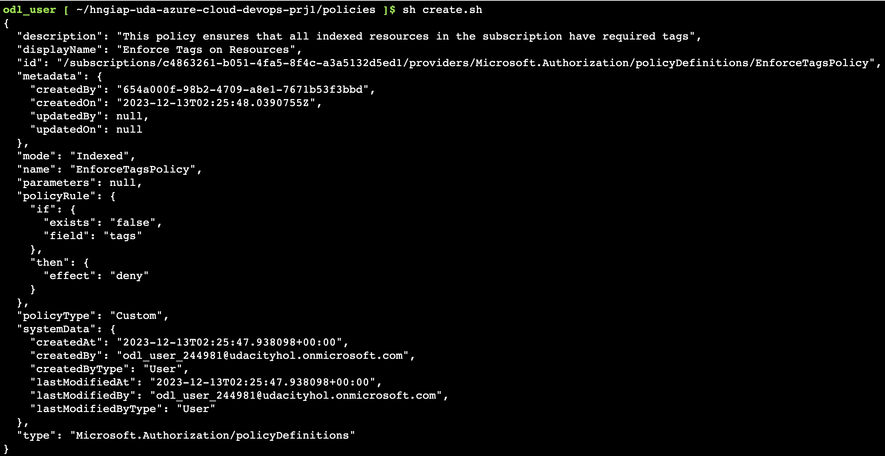
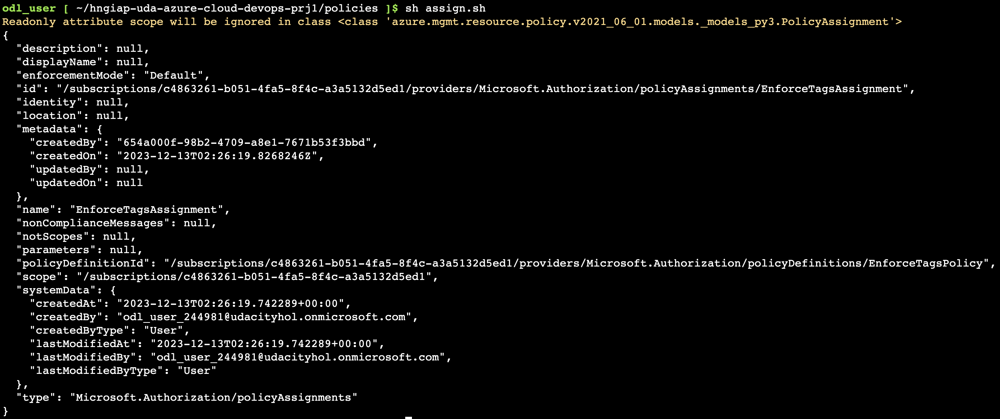
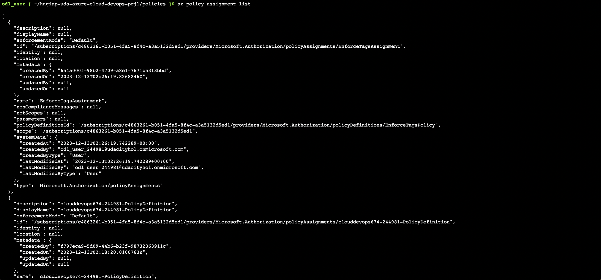
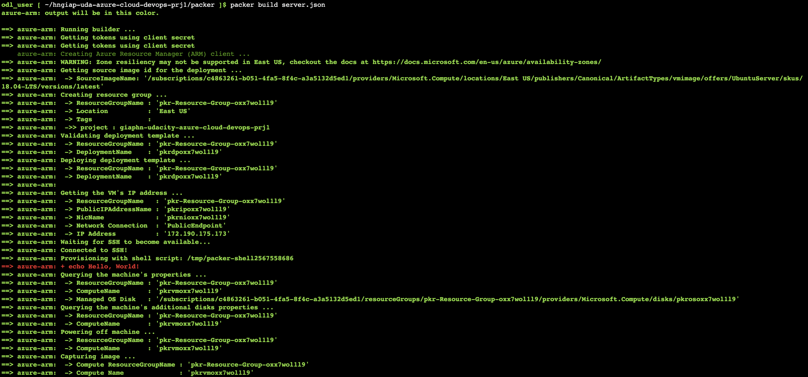
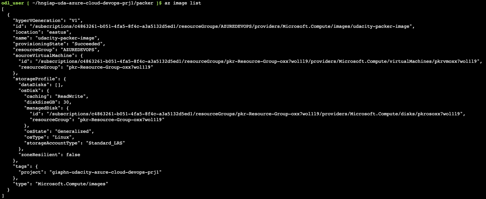
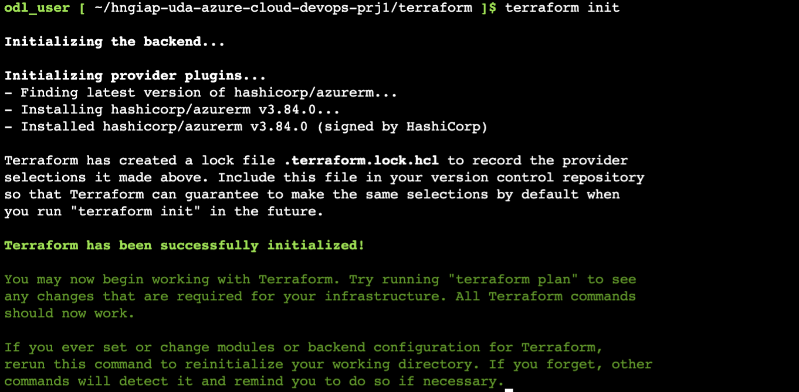
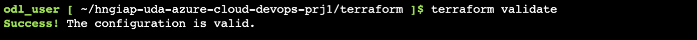
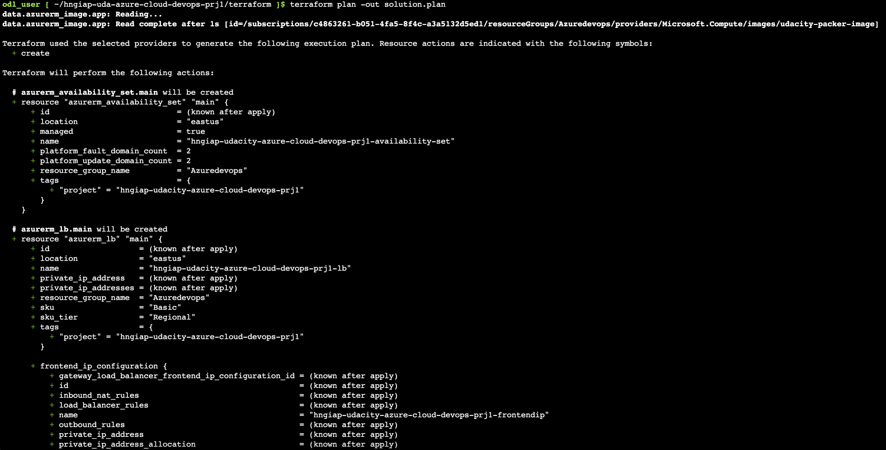
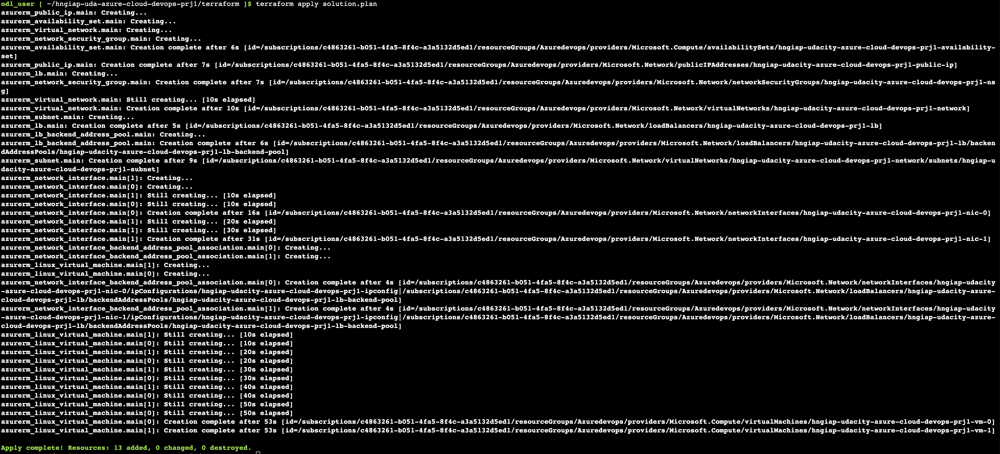

# Deploying a Web Server in Azure
## Table of contents
- [Overview](#overview)
- [Dependencies](#dependencies)
- [Deploy Application](#deploy-application)
    - [Setup Environment Variables](#setup-environment-variables)
    - [Deploy a Policy](#deploy-a-policy)
    - [Build Packer Image](#build-packer-image)
    - [Deploy Infrastructure Using Terraform](#deploy-infrastructure-using-terraform)
- [Clean Up Application](#clean-up-application)

## Overview

In this project, you will deploy a web server on Azure using Packer to build VM images and Terraform to deploy application's infrastructures
## Dependencies
- An Azure account
- An installation of the latest version of [Terraform](#https://developer.hashicorp.com/terraform/install)
- An installation of the latest version of [Packer](#https://developer.hashicorp.com/packer/install)
- An installation of the latest version of [Azure CLI](#https://learn.microsoft.com/en-us/cli/azure/)

## Deploy Application
### Setup Environment Variables
- Create ```.env``` file at the ```root``` directory with contents bellow:
```
ARM_CLIENT_ID=""
ARM_CLIENT_SECRET=""
ARM_TENANT_ID=""
ARM_SUBSCRIPTION_ID=""
ARM_RESOURCE_GROUP=""
ARM_LOCATION=""

# Terraform environments
TF_VAR_vm_username=""
TF_VAR_vm_password=""
```
- Update environment variables of your own
- Run following command to export all environment variables for use
```
set -o allexport && source .env && set +o allexport
```

### Deploy a Policy
- Navigate into ```policies``` directory
- Run the ```create.sh``` script to create a policy definition on Azure
```
sh create.sh
```

- Run the ```assign.sh``` script to assign policy definition created above
```
sh assign.sh
```

- List policy assignments to verify
```
az policy assignment list
```


### Build Packer Image
- Build virtual machine image using following command:
```
packer build server.json
```

- List image using Azure CLI to verify
```
az image list
```


### Deploy Infrastructure Using Terraform
- Initialize Working Directories
```
terraform init
```

- Validate terraform template
```
terraform validate
```

- Create infrastructure plan
```
terraform plan -out solution.plan
```

- Deploy the infrastructure plan
```
terraform apply solution.plan
```


## Clean Up Application
- Destroy terraform
```
cd terraform
terraform destroy
```
- Delete VM image
```
az iamge delete -g <resource group> -n <image name>
```